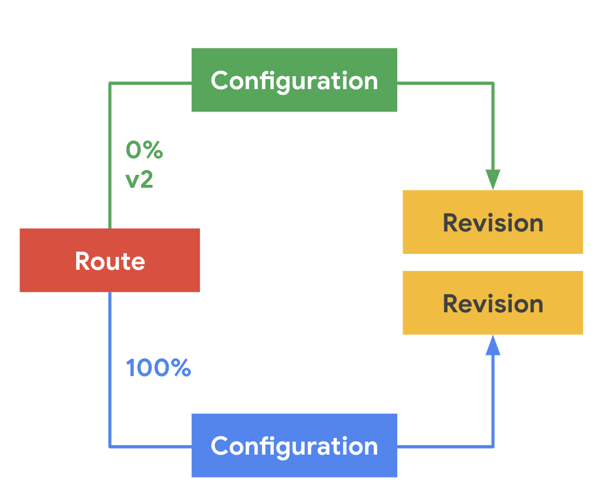
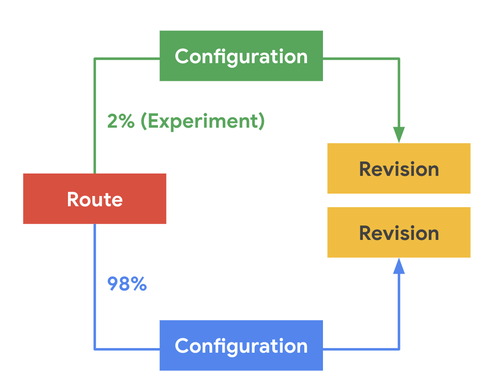
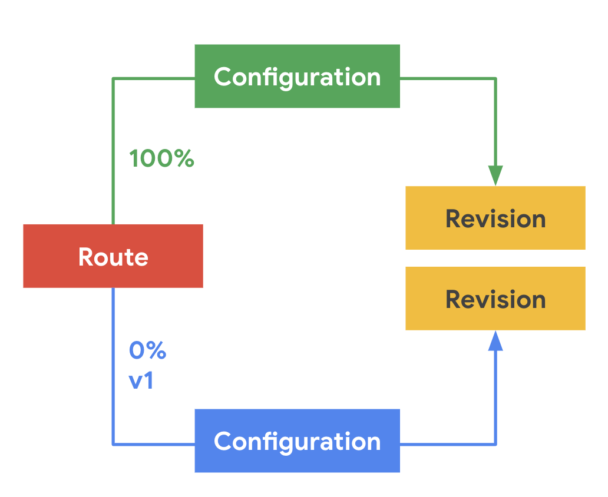

# Demo: Routing and managing traffic with blue/green deployment

This demo shows how to update an application to a new version using a blue/green
traffic routing pattern. With Knative, you can safely reroute traffic from a live version
of an application to a new version by changing the routing configuration.

> Using custom domain with wildcard SSL cert configured for `default.project-serverless.com`. The `route-demo` application will be demo'd over HTTPS but the named routes like `v1` and `v2` will be accessed over HTTP.

## Deploying Version 1 (Blue)

Deploy the first version of the app to your cluster:

`kubectl apply -f blue-green-deploy/stage1.yaml`

The result will look like this


When the route is created and IP is assigned, navigate to https://route-demo.default.project-serverless.com
to view the deployed app.

## Deploying Version 2 (Green)

Version 2 of the sample application displays the text "App v2" on a green background:

`kubectl apply -f blue-green-deploy/stage2.yaml`

Version 2 of the app is staged at this point. That means:

* No traffic is routed to Version 2 at the main URL
* Knative creates a new route named v2 for testing the newly deployed version

The result will look like this


You can refresh the app URL (https://route-demo.default.project-serverless.com) to see that
the v2 app takes no traffic, but you can navigate directly to http://v2.route-demo.default.project-serverless.com
to view the new `v2` named route.

## Migrating traffic to the new version

Deploy the updated routing configuration to your cluster:

`kubectl apply -f blue-green-deploy/stage3.yaml`

The result will look like this


Now, refresh the original route https://route-demo.default.project-serverless.com a few times to see
that some traffic now goes to version 2 of the app.

> This sample shows a 50/50 split to assure that you don't have to refresh too much, but it's recommended
  to start with 1-2% of traffic in a production environment.

## Re-routing all traffic to the new version

Deploy the updated routing configuration to your cluster:

`kubectl apply -f blue-green-deploy/stage4.yaml`

This will complete the deployment by sending all traffic to the new (green) version.

The result will look like this


Refresh original route https://route-demo.default.project-serverless.com a few times to verify that
no traffic is being routed to v1 of the app.

Note that:

* We kept the v1 (blue) entry with 0% traffic for the sake of speedy reverting, if that is ever necessary.
* We added the named route `v1` to the old (blue) version of the app to allow access for comparison reasons.

Now you can navigate to http://v1.route-demo.default.project-serverless.com to show that the old version
is accessible via the `v1` named route.


## Cleanup

To delete the demo app, enter the following commands:

```
kubectl delete -f blue-green-deploy/stage4.yaml --ignore-not-found=true
kubectl delete -f blue-green-deploy/stage3.yaml --ignore-not-found=true
kubectl delete -f blue-green-deploy/stage2.yaml --ignore-not-found=true
kubectl delete -f blue-green-deploy/stage1.yaml --ignore-not-found=true
```
