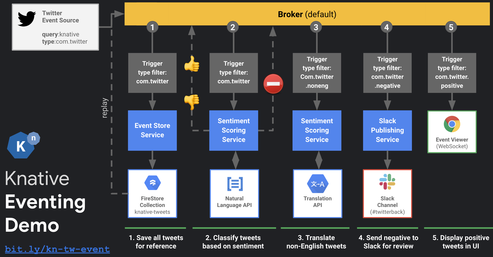

# Knative Events using Twitter, Cloud Firestore, Slack, and WebSockets Viewer

Simple pipeline combining Twitter search results and Knative Events to store, classify and display events



## Setup

### Event Source

To configure the Twitter event source you will need Twitter API access keys. [Good instructions on how to get them](https://iag.me/socialmedia/how-to-create-a-twitter-app-in-8-easy-steps/)

Once you get the four keys, you will need to create Twitter API keys secret:

```shell
kubectl create secret generic ktweet-secrets -n demo \
    --from-literal=T_CONSUMER_KEY=${T_CONSUMER_KEY} \
    --from-literal=T_CONSUMER_SECRET=${T_CONSUMER_SECRET} \
    --from-literal=T_ACCESS_TOKEN=${T_ACCESS_TOKEN} \
    --from-literal=T_ACCESS_SECRET=${T_ACCESS_SECRET}
```

Additionally, you will need to define the search term for which you want the source to search Twitter (`--query=YourSearchTermHere`) in `config/twitter-source.yaml`. Once you are done editing, save the file and apply to your Knative cluster:


```shell
kubectl apply -f config/twitter-source.yaml -n demo
```

Should return

```shell
containersource.sources.eventing.knative.dev/twitter-source created
```

Verify that `twitter-source` source was created

```shell
kubectl get sources -n demo
```

Should return

```shell
NAME                                                          AGE
containersource.sources.eventing.knative.dev/twitter-source   1m
```

You can also right away see if the there are some tweets matching your search

```shell
kubectl logs -l eventing.knative.dev/source=twitter-source -n demo -c source
```

Should return

```shell
2019/07/11 13:23:14 Got tweet:     1149308143958134784
2019/07/11 13:23:14 Posting tweet: 1149308143958134784
2019/07/11 13:23:14 Got tweet:     1149308145359118336
2019/07/11 13:23:14 Posting tweet: 1149308145359118336
```

### Store Service (Step #1)

If you haven't done so already, you will need to enable Firestore in your GCP project, [create Cloud Firestore project](https://console.cloud.google.com/projectselector/apis/api/firestore.googleapis.com/overview), which will also enables your API in the Cloud API Manager.

The store service will persist tweets into collection defined in the `config/store-service.yaml` (`knative-tweets` by default). To deploy this service apply it to your Knative cluster the same way you configured the above event source.


```shell
kubectl apply -f config/store-service.yaml -n demo
```

The response should be

```shell
service.serving.knative.dev/eventstore created
```

To check if the service was deployed successfully you can check the status using `kubectl get pods -n demo` command. The response should look something like this (e.g. Ready `3/3` and Status `Running`).

```shell
NAME                                          READY     STATUS    RESTARTS   AGE
eventstore-0000n-deployment-5645f48b4d-mb24j  3/3       Running   0          10s
```

Now that you have both the event source and service configured you can wire these two with simple trigger. You should not have to edit the `config/store-trigger.yaml` file unless you made some naming changes above.

Two things to point here, were are using `type: com.twitter` filter to send to our `eventstore` service only the events of twitter type. We also define the target service here by defiing its reference in the `subscriber` portion of trigger.

To create a trigger run:

```shell
kubectl apply -f config/store-trigger.yaml -n demo
```

Should return

```shell
trigger.eventing.knative.dev/twitter-events-trigger created
```

Verity that `twitter-events-trigger` trigger was created

```shell
kubectl get triggers -n demo
```

Should return

```shell
NAME                     READY   REASON    BROKER    SUBSCRIBER_URI                                          AGE
twitter-events-trigger   True              default   http://twitter-events-trigger.demo.svc.cluster.local/   12s
```

## Quick Test

You should be able now see the Cloud Events being saved in your Firestore console under the `knative-tweets` collection (unless you changed the name during store service deployment)

You can also monitor the logs for both `twitter-source`

```shell
kubectl logs -l eventing.knative.dev/source=twitter-source -n demo -c source
```

and `store-service`

```shell
kubectl logs -l serving.knative.dev/service=eventstore -n demo -c user-container
```

## Classification Service (Step #2)

Now that the tweets are being published by our source to the default broker, we can create the trigger and service that will classify these tweets. The service exposes variable in `config/classifier-service.yaml` for the level of magnitude that will be required (`MIN_MAGNITUDE`) for a tweet text to be considered either positive or negative. To deploy this service apply:


```shell
kubectl apply -f config/classifier-service.yaml -n demo
```

The response should be

```shell
service.serving.knative.dev/sentclass configured
```

To check if the service was deployed successfully you can check the status using `kubectl get pods -n demo` command. The response should look something like this (e.g. Ready `3/3` and Status `Running`).

```shell
NAME                                          READY     STATUS    RESTARTS   AGE
sentclass-gmhd2-deployment-ff6ccfc45-nkwdj    2/2       Running   0          53m
```

Now that you have both the classification service configured you can wire these two with a trigger. You should not have to edit the `config/classifier-trigger.yaml` file unless you made some naming changes above.

Just like in the event store service, were are using `type: com.twitter` filter to send to our `sentclass` service only the events of twitter type. We also define the target service here by defiling its reference in the `subscriber` portion of trigger.

To create a trigger run:

```shell
kubectl apply -f config/classifier-trigger.yaml -n demo
```

Should return

```shell
trigger.eventing.knative.dev/sentiment-classifier-trigger created
```

Verity that `sentiment-classifier-trigger` trigger was created

```shell
kubectl get triggers -n demo
```

Should return

```shell
NAME                         READY   BROKER    SUBSCRIBER_URI                            AGE
sentiment-classifier-trigger  True    default   http://sentclass.demo.svc.cluster.local   17h
```


## View Service (Step #4)

The classification service defined in step #2 will publish results to the default broker. The the negative tweets with type `com.twitter.negative` and positive with type `com.twitter.positive`. Let's create the viewing service now so we can see the positive tweets and come back to the negative tweets that will be published to slack later.

To do that let's deploy the viewer app. To deploy this service apply:


```shell
kubectl apply -f config/view-service.yaml -n demo
```

The response should be

```shell
service.serving.knative.dev/kcm configured
```

To check if the service was deployed successfully you can check the status using `kubectl get pods -n demo` command. The response should look something like this (e.g. Ready `3/3` and Status `Running`).

```shell
NAME                                           READY     STATUS    RESTARTS   AGE
tweetviewer-wkmmn-deployment-5b8d5f8c7c-tm87l  2/2       Running   0          53m
```

Now that you have both the viewer service configured, you can wire it to the broker with a trigger. You should not have to edit the `config/view-trigger.yaml` file unless you made some naming changes above. The only thing to point out here is that we are now filtering only the events that have been clasified as psitive (type: `com.twitter.positive`).

```yaml
filter:
  sourceAndType:
    type: com.twitter.positive
```

To create a trigger run:

```shell
kubectl apply -f config/view-trigger.yaml -n demo
```

Should return

```shell
trigger.eventing.knative.dev/twitter-events-viewer created
```

Verity that `twitter-events-viewer` trigger was created

```shell
kubectl get triggers -n demo
```

Should return

```shell
NAME                    READY   BROKER    SUBSCRIBER_URI                               AGE
twitter-events-viewer   True    default   http://tweetviewer.demo.svc.cluster.local    17h
```


## Slack Publish (Step #3)

The classification service defined in step #2 identifies also tweets that appear to be negative and posts them back to the default broker with the `com.twitter.negative` type. Let's create the Slack publish service now that will post these tweets to a Slack channel.

First, create a secret with the Slack token and channel details:

> Note, Slack channel is not the name of the channel but rather it's ID

```shell
kubectl create secret generic slack-notif-secrets -n demo \
  --from-literal=SLACK_CHANNEL=$SLACK_KN_TWEETS_CHANNEL \
  --from-literal=SLACK_TOKEN=$SLACK_KNTWEETS_API_TOKEN
```

Now, lets' install the Slack publishing service:


```shell
kubectl apply -f config/slack-service.yaml -n demo
```

The response should be

```shell
service.serving.knative.dev/slack-publisher configured
```

To check if the service was deployed successfully you can check the status using `kubectl get pods -n demo` command. The response should look something like this (e.g. Ready `3/3` and Status `Running`).

```shell
NAME                                           READY     STATUS    RESTARTS   AGE
slack-publisher-wkmmn-deployment-5b8d5f8c7c    2/2       Running   0          53m
```

Now that you have both the viewer service configured, you can wire it to the broker with a trigger. You should not have to edit the `config/slack-trigger.yaml` file unless you made some naming changes above. The only thing to point out here is that we are now filtering only the events that have been classified as positive (type: `com.twitter.negative`).

```yaml
filter:
  sourceAndType:
    type: com.twitter.negative
```

To create a trigger run:

```shell
kubectl apply -f config/slack-trigger.yaml -n demo
```

Should return

```shell
trigger.eventing.knative.dev/slack-tweet-notifier created
```

Verity that `twitter-events-viewer` trigger was created

```shell
kubectl get triggers -n demo
```

Should return

```shell
NAME                  READY   BROKER    SUBSCRIBER_URI                                   AGE
slack-tweet-notifier   True    default   http://slack-publisher.demo.svc.cluster.local    17h
```


## Reset

Run this before each demo to set known state:

```shell
kubectl delete -f config/ -n demo --ignore-not-found=true
kubectl delete secret ktweet-secrets -n demo
kubectl delete secret slack-notif-secrets -n demo

```