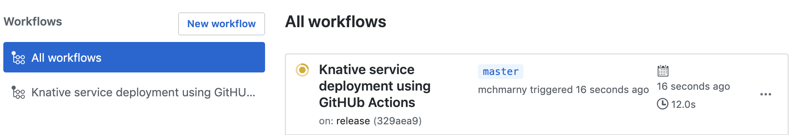
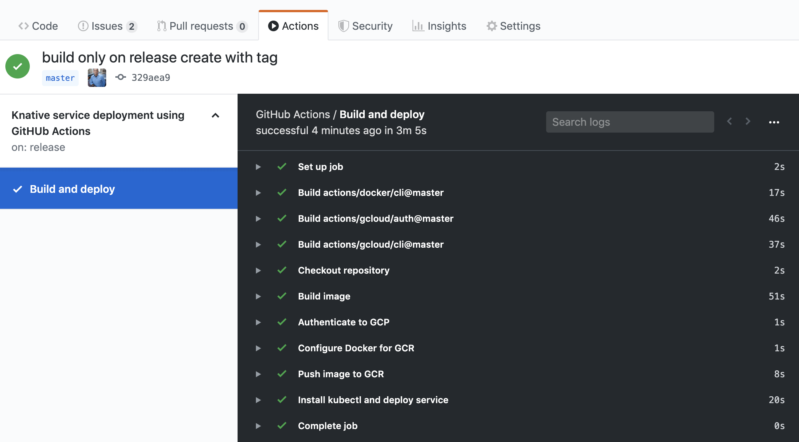

# GitHub Action to build/deploy to Knative on release tag

This demo will illustrate how to use [GitHub action](https://github.com/actions) to build Docker Image from this repository and deploy it to Knative.

## Setup

### Define Secrets

Navigate to the setting tab of your repository and create these secrets

* `GCP_PROJECT` - ID of your project
* `GCP_SA_KEY` - base64 encoded service account key
* `CLUSTER_NAME` - name of your GKE cluster in the above project
* `CLUSTER_ZONE` - fully qualified GCP compute zone in which your cluster resides
* `CLUSTER_NS` - name of the namespace to which you will be deploying

### Create Action

Click on the Action tab at the top of your repository and create a new workflow with the following YAML

```yaml
name: Knative service deployment using GitHUb Actions

on:
  release:
    types: [created]
    tags:
      - release-v*

jobs:
  deploy:
    name: Build and deploy
    runs-on: ubuntu-latest
    steps:
      - name: Checkout repository
        uses: actions/checkout@master

      - name: Build image
        uses: actions/docker/cli@master
        with:
          args: "build --tag gcr.io/${{ secrets.GCP_PROJECT }}/greeter:${{ github.sha }} ./github-action-deploy"

      - name: Authenticate to GCP
        uses: actions/gcloud/auth@master
        env:
          GCLOUD_AUTH: ${{ secrets.GCP_SA_KEY }}

      - name: Configure Docker for GCR
        uses: actions/gcloud/cli@master
        with:
          args: "auth configure-docker --quiet"

      - name: Push image to GCR
        uses: actions/gcloud/cli@master
        with:
          entrypoint: sh
          args: -c "docker push gcr.io/${{ secrets.GCP_PROJECT }}/greeter:${{ github.sha }}"

      - name: Prepare service manifest
        run: sed -e 's/PROJECT_ID/${{ secrets.GCP_PROJECT }}/g; s/APP_NAME/greeter/g; s/COMMIT_SHA/${{ github.sha }}/g' github-action-deploy/template.yaml > github-action-deploy/service.yaml

      - name: Install kubectl and deploy service
        uses: actions/gcloud/cli@master
        with:
          args: "components install kubectl --quiet && gcloud container clusters get-credentials ${{ secrets.CLUSTER_NAME }} --project ${{ secrets.GCP_PROJECT }} --zone ${{ secrets.CLUSTER_ZONE }} && kubectl apply -f ./github-action-deploy/service.yaml -n ${{ secrets.CLUSTER_NS }}"
```

This build action makes substitutions in the included Knative service manifest

```yaml
apiVersion: serving.knative.dev/v1
kind: Service
metadata:
  name: APP_NAME
spec:
  template:
    spec:
      containers:
        - image: gcr.io/PROJECT_ID/APP_NAME:COMMIT_SHA
          env:
            - name: RELEASE
              value: "COMMIT_SHA"
```

* `APP_NAME` is replaced with `greeter`
* `PROJECT_ID` is replaced with secret `GCP_PROJECT`
* `COMMIT_SHA` is replaced with action context `github.sha`


## Demo

The above action will fire on creation of release. To demo, create new release with the release tag starting with `action-demo-v` (e.g. `action-demo-v0.1.1`). This will trigger the action to run.



When done, assuming everything worked as intended, the action screen will show all the completed steps.



If there were any issues during execution of this action, the above screen will include the error that should help you in debugging.