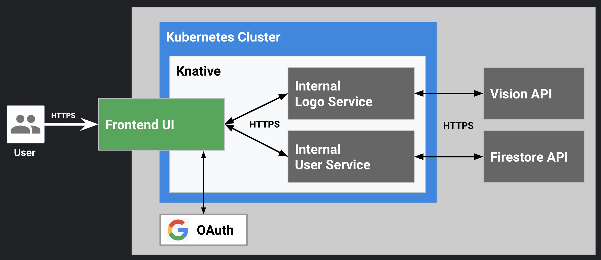
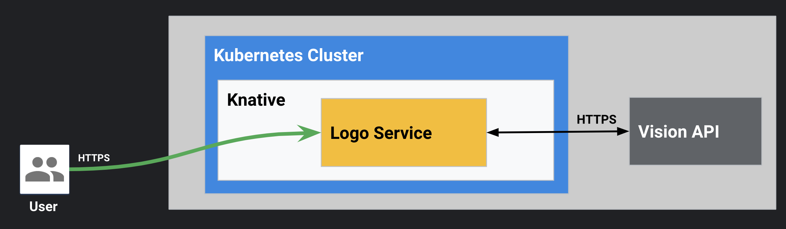
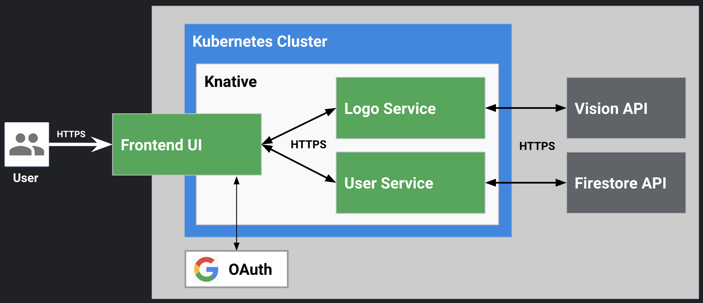
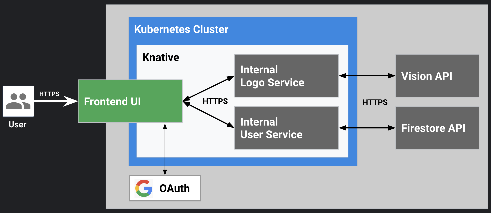

# Demo: Internal (cluster local) Service

Microservice demo showcasing Knative service request path access configuration and GCP service integration using [Knative](https://github.com/knative/docs). This uses pre-built images of following Knative demo services:

* [Logo Service](https://github.com/mchmarny/klogo) - detects company logo from images using [Cloud Vision API](https://cloud.google.com/vision/)
* [User Service](https://github.com/mchmarny/kuser) - user state management backed by Cloud [Firestore API](https://cloud.google.com/firestore/)



## Setup

### Google OAuth Credentials

To set it up, in your Google Cloud Platform (GCP) project console navigate to the Credentials section. You can use the search bar, just type `Credentials` and select the option with "API & Services". To create new OAuth credentials:

* Click “Create credentials” and select “OAuth client ID”
* Select "Web application"
* Add authorized redirect URL at the bottom using the fully qualified domain we defined above and appending the `callback` path:
 * `https://logoui.demo.knative.tech/auth/callback`
* Click create and copy both `client id` and `client secret`
* CLICK `OK` to save

> You will also have to verify the domain ownership. More on that [here](https://support.google.com/cloud/answer/6158849?hl=en#authorized-domains)

For ease of use, export the copied client `id` as `OAUTH_CLIENT_ID` and `secret` as `OAUTH_CLIENT_SECRET` in your environment variables (e.g. ~/.bashrc or ~/.profile) and create a secret

```shell
# kubectl delete secret logoui -n demo
kubectl create secret generic logoui -n demo \
 --from-literal=OAUTH_CLIENT_ID=$OAUTH_CLIENT_ID \
 --from-literal=OAUTH_CLIENT_SECRET=$OAUTH_CLIENT_SECRET
```

### Google Cloud Firestore

If you haven't used Firestore on GCP before, you will have to enable its APIs. You can find instructions on how to do it [here](https://firebase.google.com/docs/firestore/quickstart) but the basic steps are:

* Go to the [Cloud Firestore Viewer](https://console.cloud.google.com/firestore/data)
* Select `Cloud Firestore in Native mode` from service screen
* Choose your DB location and click `Create Database`

## Deploy

This demo uses three pre-build images:

* logo ([gcr.io/cloudylabs-public/logo:1.0.1](https://gcr.io/cloudylabs-public/logo:1.0.1))
* user ([gcr.io/cloudylabs-public/user:1.0.2](https://gcr.io/cloudylabs-public/user:1.0.2))
* ui ([gcr.io/cloudylabs-public/logoui:1.0.1](https://gcr.io/cloudylabs-public/logoui:1.0.1))

To deploy all three of these services used in this demo:

```shell
kubectl apply -f config/
```

> Note, this assumes you have already configured `demo` namespace. Also, make sure the cluster local label on logo service is commented out from the previous demo

## Demo

### Call logo service directly



Invoke the service using `curl` and pass image URL to identify

```shell
curl -H "Content-Type: application/json" \
     -d '{"id":"test","url":"https://storage.googleapis.com/kdemo-logos/google.png"}' \
     https://logo.demo.knative.tech/
```

> Consider using `jq` and pipe `| jq "."` the results of the above command for prettier JSON

The response should look like this:

```json
{
  "req": {
    "id": "test",
    "url": "https://storage.googleapis.com/kdemo-logos/google.png"
  },
  "desc": "Google"
}
```

But now the entire world is using you Cloud Vision API credits!

### Front logo service with UI (auth & client throttling)



Navigate to https://logoui.demo.knative.tech/ and show the OAuth. That's nice, but users are still able to access the service directly. The following command still returns the same JSON.

```shell
curl -H "Content-Type: application/json" \
     -d '{"id":"test","url":"https://storage.googleapis.com/kdemo-logos/google.png"}' \
     https://logo.demo.knative.tech/
```


### Configure logo service as Internal (cluster local)

Edit the [config/logo.yaml](config/logo.yaml) and uncomment the `visibility: cluster-local` label to look like this

```yaml
apiVersion: serving.knative.dev/v1
kind: Service
metadata:
  name: logo
  namespace: demo
  labels:
    serving.knative.dev/visibility: cluster-local
```

 This will prevent the Knative service from creating public (externally accessible) route, which will prevents direct access using the `logo.demo.knative.tech` URL. In stead, the UI service will be using a cluster local address of the logo service `logo.demo.svc.cluster.local`

 Apply the update logo manifest like this

 ```shell
kubectl apply -f config/logo.yaml
```

### Validate logo service is cluster-local



```shell
curl -v -H "Content-Type: application/json" \
     -d '{"id":"test","url":"https://storage.googleapis.com/kdemo-logos/google.png"}' \
     https://logo.demo.knative.tech/
```

## Cleanup

To remove the three services used in this demo

```shell
kubectl delete -f config/
```

The above user the verbose output flag (`-v`) but the key part here is that the result is the service not found error (`HTTP/2 404`).

## Disclaimer

This is my personal project and it does not represent my employer. I take no responsibility for issues caused by this code. I do my best to ensure that everything works, but if something goes wrong, my apologies is all you will get.


